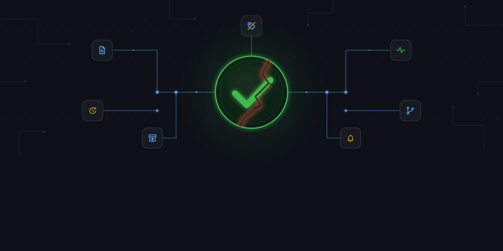

# ci-reliability-toolkit

Seven small, independent tools for a recurring problem: CI that reports
green without actually proving what it claims to. Each one targets a
different way that happens — a fabricated report, a flaky test blocking
a real deploy, a pipeline testing a frozen source, a silent crash loop,
a missing alert, a stale skip tag.

Each tool lives in its own folder with its own `package.json`/`action.yml`
and its own README — use them independently, there's no shared runtime
between them.

## Tools

| Tool | Problem it catches |
|---|---|
| [ci-false-green-detector](./ci-false-green-detector) | A CI report that says "0 failures" because nothing ran, not because the suite passed |
| [flaky-test-confidence-gate](./flaky-test-confidence-gate) | A single flaky failure blocking a deploy, drowning out real regressions in noise |
| [stale-ci-source-detector](./stale-ci-source-detector) | A pipeline testing a repository that's since been archived — frozen code, forever green |
| [ci-run-frequency-monitor](./ci-run-frequency-monitor) | A pipeline crash-looping or stalling silently while its last status stays green |
| [conditional-ci-pipeline-template](./conditional-ci-pipeline-template) | Expensive test jobs running on every push instead of being gated behind a label |
| [slack-ci-alert-bridge](./slack-ci-alert-bridge) | No way to alert on CI failure without admin rights to install a native plugin |
| [stale-flag-reconciler](./stale-flag-reconciler) | A "skip until X ships" tag nobody removed after X actually shipped |

## Status

Each tool here is a from-scratch reimplementation of a pattern I used in
production QA/CI work — generalized, with no original code, infra, host
names, or company-specific data. See each tool's own README for the
specific incident that motivated it.

## License

MIT — see [LICENSE](./LICENSE).
